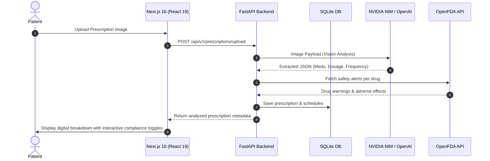

# 💊 SmartRx — Intelligent Prescription & Medication Assistant

[](https://smartrx-frontend.onrender.com)
[](https://fastapi.tiangolo.com/)
[](https://nextjs.org/)
[](https://www.typescriptlang.org/)
[](https://www.sqlite.org/)
[](https://build.nvidia.com/)
[](https://tailwindcss.com/)
[](https://render.com/deploy?repo=https://github.com/Navya110305/SmartRx)

---

SmartRx is a state-of-the-art, premium medical assistant application. It allows users to scan paper prescriptions using advanced AI computer vision, automatically extracts prescribed medications with precise dosages and warnings, performs safety cross-checks against the official **OpenFDA database**, tracks daily compliance streaks in a gorgeous interactive tracker, and features a real-time conversational AI health assistant.

> **🌐 Live Demo:** [https://smartrx-frontend.onrender.com](https://smartrx-frontend.onrender.com)

---

## ⚡ Key Features

1. **📷 AI Prescription OCR Scanner**
   - Upload any image of a handwritten or printed prescription.
   - Leverages NVIDIA NIM/OpenAI vision models to extract drug names, dosages, frequencies, and specific intake notes.
2. **⚠️ OpenFDA Safety Checks**
   - Automatically cross-references extracted medications with the OpenFDA API to flag potential adverse reactions, drug-to-drug interactions, and safety alerts.
3. **📅 Intelligent Compliance Tracker**
   - High-fidelity daily dashboard featuring morning/afternoon/evening schedules.
   - One-click actions to mark medicines as **Taken** or **Missed** with real-time gamified streak counters.
4. **💬 Conversational AI Health Assistant**
   - Sandbox chat terminal powered by LLM models for context-aware queries about prescription info, side effects, and health guides.
5. **🔒 Secure Session Authentication**
   - Secure sign-up, login, and profile tracking using JWT access tokens.
6. **📱 Progressive Web App (PWA)**
   - Installed seamlessly on iOS Safari and Android Chrome as a native app with customized startup icons.

---

## 🛠️ Tech Stack

| Layer | Technology |
|-------|-----------|
| **Frontend** | Next.js 16, React 19, TypeScript, Tailwind CSS v4 |
| **Backend** | FastAPI, Python 3.11+, SQLAlchemy, Uvicorn |
| **Database** | SQLite (dev) / PostgreSQL (production) |
| **AI Engine** | NVIDIA NIM (Llama 3.2 Vision + Llama 3.3 70B) / OpenAI GPT-4o |
| **Drug Safety** | OpenFDA API |
| **Auth** | JWT (PyJWT) + bcrypt |
| **Deployment** | Render (Blueprint IaC) |

---

## 📐 System Architecture



---

## 🚀 Local Installation & Setup

Ensure you have **Python 3.10+** and **Node.js 18+** installed on your system.

### 1. Backend Configuration

Navigate into the backend folder, initialize the virtual environment, and install dependencies:

```bash
# Go to backend directory
cd backend

# Create virtual environment
python -m venv venv

# Activate virtual environment (Windows PowerShell)
.\venv\Scripts\Activate.ps1

# Install requirements
pip install -r requirements.txt
```

Create a `.env` file in the `backend/` directory using the template below:

```ini
# Database Configuration
DATABASE_URL=sqlite:///./sql_app.db

# Authentication Secret
JWT_SECRET=your-jwt-secret-key-change-in-production

# AI Services (NVIDIA NIM or OpenAI Key)
OPENAI_API_KEY=your_nvidia_nim_or_openai_api_key_here

# Frontend CORS Origin URL
FRONTEND_URL=http://localhost:3000
```

Start the FastAPI application server:

```bash
uvicorn app.main:app --host 127.0.0.1 --port 8000 --reload
```

The API docs will be live at `http://127.0.0.1:8000/docs`.

---

### 2. Frontend Configuration

Navigate into the frontend folder and install standard dependencies:

```bash
# Go to frontend directory
cd ../frontend

# Install node packages
npm install
```

Start the Next.js development server:

```bash
npm run dev
```

Open [http://localhost:3000](http://localhost:3000) in your browser to view the application.

---

## ☁️ Deployment (Render)

This project includes a `render.yaml` Blueprint for one-click deployment to [Render](https://render.com):

1. Click the **Deploy to Render** badge above (or go to Render Dashboard → New → Blueprint).
2. Connect your GitHub repo and select the `main` branch.
3. Set the required environment variables when prompted:
   - `OPENAI_API_KEY` — Your NVIDIA NIM or OpenAI API key
   - `FRONTEND_URL` — Your frontend's Render URL (e.g. `https://smartrx-frontend.onrender.com`)
   - `NEXT_PUBLIC_API_URL` — Your backend's Render URL (e.g. `https://smartrx-backend.onrender.com`)
4. Click **Deploy Blueprint** — Render provisions both services automatically.

---

## 📄 License
This project is licensed under the MIT License. Feel free to use and extend it!
